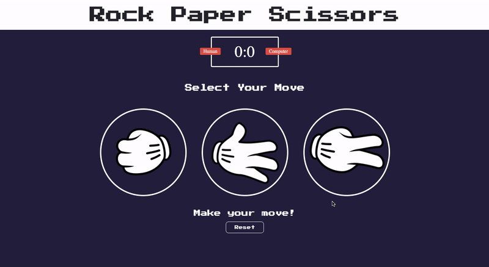

# <a href="https://adam20058.github.io/Rock-Paper-Scissors/" target="_blank"> Rock Paper Scissors Game</a>

 Rock, Paper, Scissor Game I made for school to better demonstrate the logic behind my favourite childhood game with a little visual flair. Enjoy!

## Demo

## How it Works

  <b>Objective of the game</b> 
  
It's a zero-sum game where 2 players face-off by choosing one the three possible shapes. And the winner is decided according to a circular hierarchy of the shapes

  
The 3 possible shapes are:

<ul>
<li>Rock</li>
<li>Paper</li>
<li>Scissors</li>
</ul>

  <b>Rules of Hierarchy</b> 
<ul>
<li>Rock always beat scissors, but rock loses to paper</li>
<li>Paper always beats rock, But paper loses to scissors</li>
<li>Scissors beats paper, but scissors loses to rock</li>
<li>If both shapes are the same there is a draw</li>
</ul>

  <b>Rules of Outcome</b> 
<ul>
<li>Outcome 1: Player 1 Wins and Player 2 loses</li>
<li>Outcome 2: Player 1 loses and Player 2 wins</li>
<li>Outcome 3: A draw between Player 1 and Player 2</li>
</ul>

## How to run locally

<ul>
<li>Fork the repository</li>
<li>Open "index.html" using any browser</li>
</ul>

## Technologies Used

<ul>
<li>HTML5</li>
<li>CSS3</li>
<li>Vanilla Javascript</li>
</ul>

